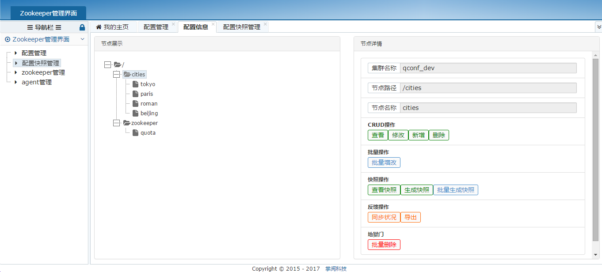
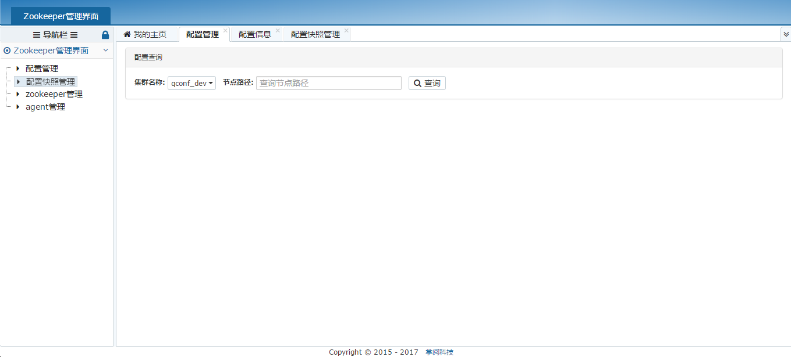
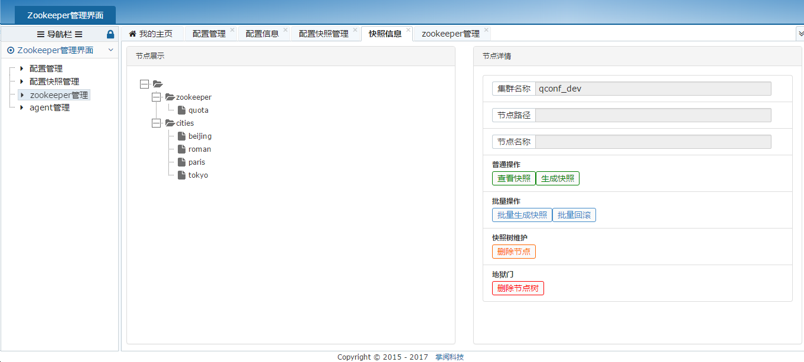
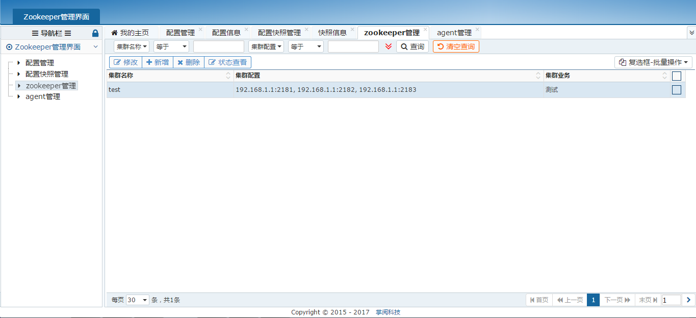

# zkdash
zkdash是一个zookeeper的管理界面，也可以作为任何基于zookeeper的配置管理项目比如：Qconf

### zkdash页面展示










### 安装与运行
安装步骤

 - 安装并运行mysql
 
 - 安装python3.5.2

 - 下载zkdash
 
       ```
       git clone https://github.com/wolfelee/zkdash.git
       ```

 - 安装依赖项

    ```
    cd zkdash
    pip install -r requirements.txt
    ```

 - 设置配置文件
 
 	根据需要修改当前目录下./conf/conf.yml中相关配置信息，配置文件详细说明见后面

 - 同步数据库表结构
      首先创建数据库zkdash，并设置数据库的用户名和密码
      将配置文件的数据库的用户名和密码进行修改
      ```
      DATABASE:
        db: 'zkdash'
        host: '192.168.1.1'   # 修改为你的数据库地址
        port: 3306   # 设置端口号
        user: 'tokyo'   # 修改用户名
        passwd: 'tokyo!'  # 修改密码
      ```
       设置完成后进行初始化数据库
 	```
 	cd zkdash
 	python ./bin/syncdb.py   # 注意执行路径必须为./bin/syncdb.py
	```
	说明：数据库使用mysql，创建表结构前请先配置数据库连接信息

 - 运行

	```
	cd zkdash
	python init.py -port=8888
	```
	说明：初次运行zkdash时需要到zookeeper管理菜单下增加监控的zookeeper集群ip信息


### 配置文件说明
配置文件详细说明

数据库配置项(DATABASE)

 - db: 数据库名称
 - host: ip地址
 - port: 端口号
 - user: 用户名
 - passwd: 密码

全局配置项

 - USE_QCONF: 是否通过QConf获取zookeeper数据（使用该项可以提高树形展示配置信息的响应速度）


### 与QConf的搭配使用

 - 反馈服务器地址：http://ip:port/api/v1/feedback（Agent同步状况查看依赖此反馈信息）


### 注意事项
 1. 新增节点需要先指定父节点，并且只能逐级增加
 2. 当设置使用QConf获取zookeeper数据时，zookeeper管理菜单下的zookeeper集群名称需要与QConf
    客户端Agent配置文件的idc名称一致

